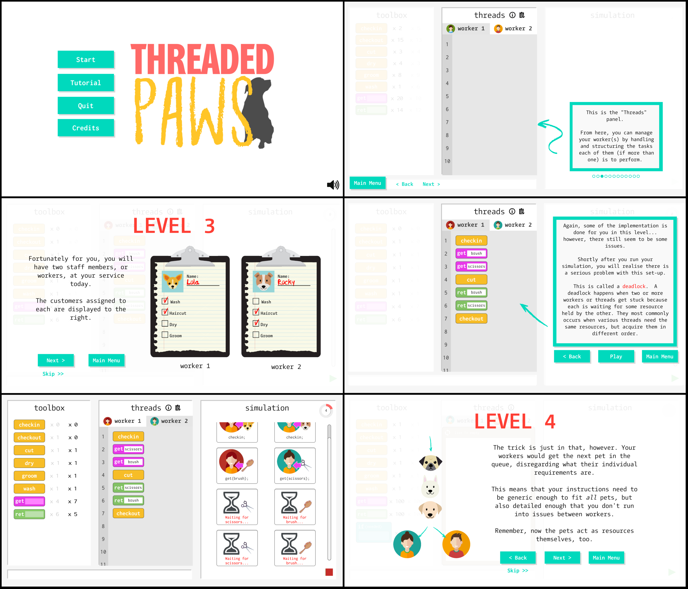

**[Threaded Paws](https://lrojas12.github.io/threadedpaws/)** is a serious game for learning about concurrency concepts including thread interleavings, data races and deadlocks. 

Advances in multi-core processors continue to increase the need for concurrent programming. Unfortunately, writing concurrent programs remains difficult due to the many, possibly unexpected program executions. Furthermore, students learning concurrent programming need to comprehend and avoid common pitfalls such as data races and deadlocks. To address this need, we have developed **Threaded Paws**, a game-based learning tool that teaches students to identify and fix concurrency pitfalls and bugs.  

